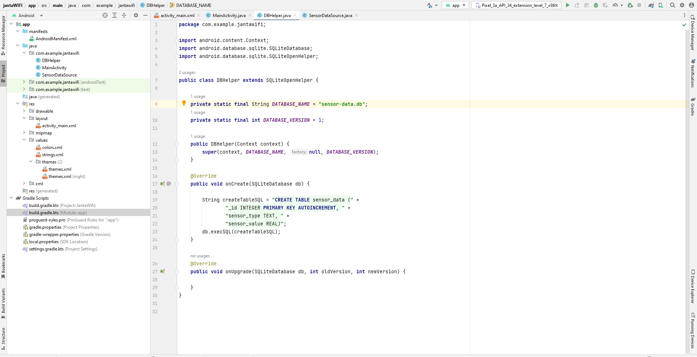

# Sensor-Data-Collection-for-Jantawifi

<b>Dear sir, Thank you for selecting me for this task. I try to fulfill all the criteria of your assigned tasks. I completed 4 tasks. However, I failed to complete task number 5. Mainly, I did not understand the task number 5. But To be honest, This is a really challenging task for me. I did not do this type of work before. I really enjoy this. I don't know how much I completed. But I am totally satisfied. As I learned something new. I also add the App-debug.apk file. I am eagerly waiting for your reply. Your task is really inspiring. I will be very grateful if I work with you. Thank You.</b>
 You will get a demo apk down of the readme.md file.
<file src = "app-debug.apk">Demo Apk</file> 
 

